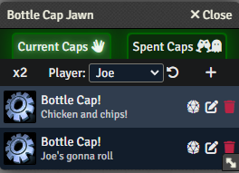

# Bottle Cap!

> **Praise Log! This system-agnostic module is an homage to [The Glass Cannon Network](https://www.glasscannonnetwork.com/) and was inspired by their house rule. Thanks to them for endless hours of prime TTRPG entertainment.**

Bottle Cap! provides an interface to track special tokens (called "bottle caps" by default) that GMs award to their players. Typically, these tokens can be spent on an important d20 roll, in order to roll twice and take the higher result. Of course, your table can use them however you like. Note, this module **does not** provide automation for any rules.

To open the Bottle Cap List, click the following button:

The list looks like this:

## Add a bottle cap

To add a bottle cap to a player, navigate to them with the drop-down menu and press the '+' button. You will get the following window:

You can choose the bottle cap's name, icon, and reason that the player got it. There are also number of system settings to change the default values for these fields. For example, you might call them a "dubloon" and change the icon to a gold coin in a pirate themed campaign.

## Spend a bottle cap

To spend a bottle cap, click the d20 icon and press "Yes" in the confirmation dialog. A message will be sent to chat.

## Notes to GMs

- By default, players can create, delete and restore their own bottle caps. You can change which User Role can manage their own bottle caps in the system settings. Only GMs can manage _everyone's_ bottle caps. All users can spend and edit their own bottle caps.

- For a user to edit the icon on a bottle cap using the file browser, you will have to give them permission to use the file browser in Foundry's User Management dialog.

## To Install

### Via Foundry Interface (recommended)

1. Open up Foundry and navigate to the "Add-on Modules" tab.
2. Click Install Module.
3. Search for "Bottle Cap!" and click the install button.
4. Enable the module in your worlds!

### Via manifest link

1. Open up Foundry and navigate to the "Add-on Modules" tab.
2. Click Install Module
3. Paste the following link <https://github.com/jalensailin/bottlecap/releases/latest/download/module.json> into the "Manifest URL" field at the bottom of the window, just to the left of the "Install" button.
4. Enable the module in your worlds!
